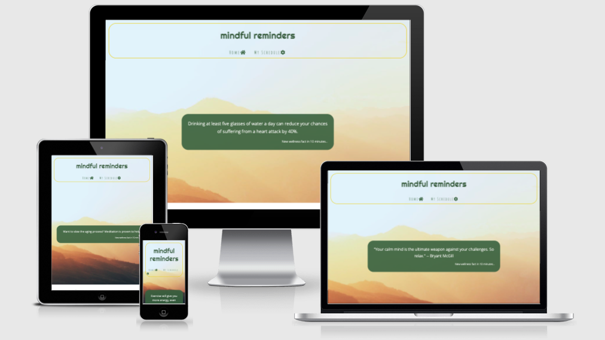
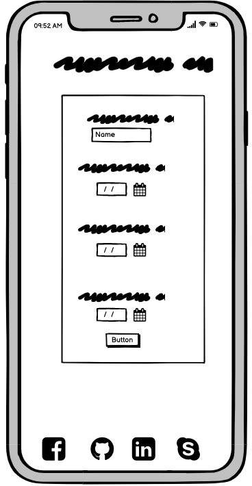
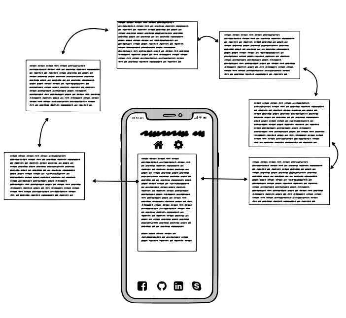
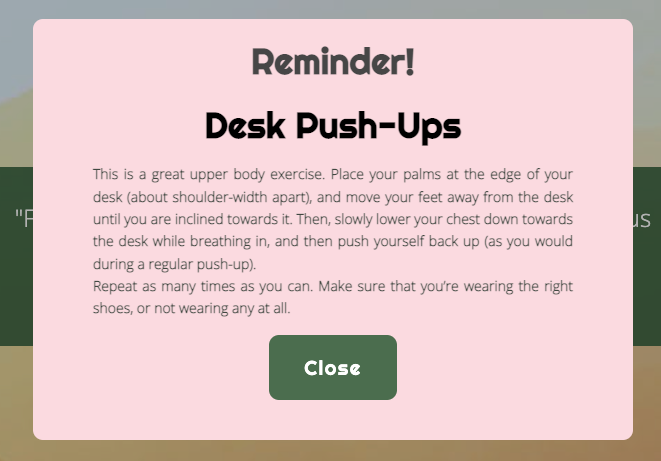
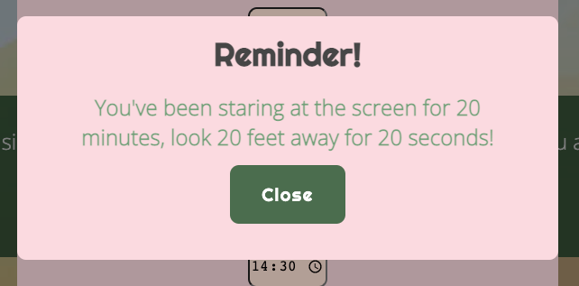
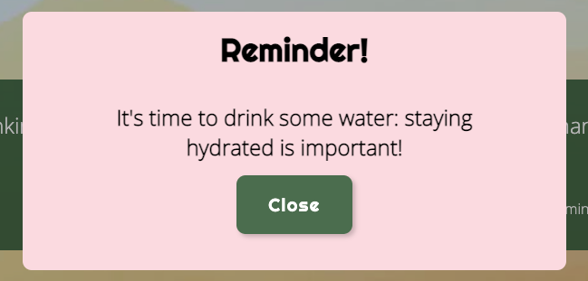
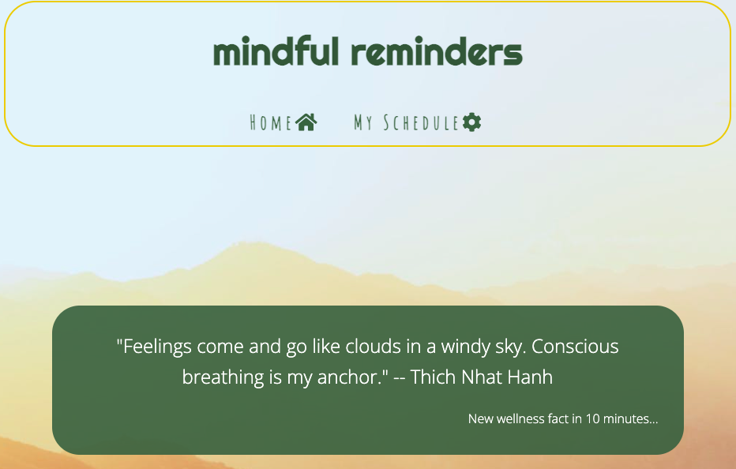

# Mindful Reminders  

[Link to Deployed Site](https://matteofiorini92.github.io/mindful-reminders/)
  
<!-- TOC -->

- [Mindful Reminders](#mindful-reminders)
  - [Objective](#objective)
  - [User Experience](#user-experience)
    - [User Stories](#user-stories)
    - [Wireframes](#wireframes)
  - [Design](#design)
    - [Colour Scheme](#colour-scheme)
  - [Features](#features)
    - [Homepage](#homepage)
    - [Schedule](#schedule)
    - [Mindful Tips](#mindful-tips)
    - [Reminders](#reminders)
    - [Wellness Tips](#wellness-tips)
    - [Future Features](#future-features)
  - [Testing](#testing)
    - [User Stories Testing](#user-stories-testing)
    - [Validator Testing](#validator-testing)
    - [Accessibility](#accessibility)
    - [Google Lighthouse Testing](#google-lighthouse-testing)
  - [Deployment](#deployment)
    - [GitHub Pages](#github-pages)
    - [Forking](#forking)
    - [Cloning](#cloning)
  - [Credits](#credits)
    - [Content](#content)
    - [Technologies Used](#technologies-used)
    - [Media](#media)
    - [Acknowledgements](#acknowledgements)

<!-- /TOC -->

## Objective  

Mindful Reminders is a platform that provides its user with the opportunity to integrate their wellness and mental health with their work routine. Studies show that practicing mindfulness can help employees manage mild depression, anxiety and other common mental health problems and that regular practice helps train the brain, such that the brain can then drop into a mindful state easier. Mindful Reminders aims to assist the user in developing this regular practice.

## User Experience

### User Stories  

- As a user I want to:

  - Integrate my work and my wellbeing.
  - Have small, manageable wellness techniques I can practice seamlessly during my workday.
  - Remember to take my breaks, for food and water.
  - Bring more structure into my personal and professional life.

### Wireframes

 

## Design  

### Colour Scheme

Research conducted by Chromatherapists suggests that using shades of blue, green and yellow can evoke calm, relieve stress and elicit happy emotions. We have taken this on board and have used shades of these colours across the site.  

## Features  

### Homepage  

The homepage contains a background image of a yellow toned nature scene that aims to evoke a sense of calm. The charity Mind states that bringing nature into your everyday life can benefit both your mental and physical wellbeing. During a workday, people may not have the opportunity to be present in nature. However, researchers led by Vrije University Medical Centre in the Netherlands conducted a study that shows that even just looking at images of nature could be enough to lower work stress levels.  

The Homepage contains the title, Mindful Reminders, a navigation bar and a modal pop-up form that appears on opening the webpage prompting the user to set their work schedule which will generate their reminders for the day.  

### Schedule  

Upon opening the Homepage, the user is greeted with a form that allows them to enter their work schedule. This includes:  

- The time they start work.
- Their morning break
- Their lunch-break.
- Their afternoon break
- The time they finish work.  

The user will be alerted with a notification at these times. This encourages the user, for example, to take their lunch break.

 These details are saved to local storage which saves the user from needing to enter each day; however, they have the option to amend this information by clicking the 'My Schedule' button in the navigation bar.

### Mindful Tips  

A 2017 study published in the Journal of Occupational Health Psychology concluded that people who engage in recovering activities during their breaks experience higher levels of well-being at the end of a working day. They concluded that mindful relaxation produced the best results in providing stress relief.  

Mindful Reminders provides the user with a range of techniques to help them to integrate a mindful routine at work, where they spend a lot of their time, to help boost their well-being.

These tips include desk exercises, breathing techniques and other mindful exercises the user can do at work.

### Reminders  

We have incorporated the 20/20/20 rule to prevent eyestrain. The user is alerted with a reminder to take a break from their screen.

And the user is reminded to stay hydrated!

### Wellness Tips  

A range of wellness facts are displayed at an interval of 10 minutes on the home screen.

### Future Features  

Time constraints prevented us from building a site containing the full scope of ideas we came up with. Below are the features we would plan to implement in the future.

- A GPS feature that takes the user's location and provides them with a list of local support options and resources. This would further boost Mindful Reminder's advocacy for the wellbeing of the user if mindful exercises are not enough to maintain the balance in their life that they require.
  
- A wider range of mindful tips to provide more variety to the user. Whilst practicing activities such as breathing techniques and exercise is cited by many as effective in bolstering wellbeing and mental health, particularly if practiced regularly which this app aims to encourage; we understand that many other techniques may also be helpful. Mindful Reminders would like to provide that variation and support to its users.  
  
- An option to share a particular tip, perhaps that the user found useful, with other colleagues or friends.

## Testing

### User Stories Testing

As a user I want to:

- Integrate my work and my wellbeing.
  - Mindful Reminders allows the user to add their schedule and receive mindful tips and reminders throughout their working day.  
  
- Have small, manageable wellness techniques I can practice seamlessly during my workday.
  - The tips are bite-size can be performed depending on the length of time the user prefers.  
  
- Remember to take my breaks, for food and water.
  - Reminders are sent out throughout the day to take breaks and drink water.  

- Bring more structure into my personal and professional life.
  - Scheduling allows the user to structure their wellbeing into their work routine.

### Validator Testing  

- [HTML](https://validator.w3.org/nu/?doc=https%3A%2F%2Fmatteofiorini92.github.io%2Fmindful-reminders%2F)
- [CSS](https://jigsaw.w3.org/css-validator/validator?uri=https%3A%2F%2Fmatteofiorini92.github.io%2Fmindful-reminders%2F&profile=css3svg&usermedium=all&warning=1&vextwarning=&lang=en)
- [JavaScript](https://jshint.com/)

### Accessibility  

We adjusted the initial colour scheme to ensure it passed WCAG standards. Initially we had a lighter, softer green for the title rgb(126, 157, 122), but it had failed the contrast checker, so we changed it to a darker shade of green, #446040, which passed.  

We also made sure to check all colours through the contrast checker to ensure maximum accessibility for users.

### Google Lighthouse Testing

## Deployment

### GitHub Pages  

To view a live preview of the site, the code has been deployed via GitHub pages. The following steps are to be followed to deploy via GitHub Pages:

1. Log into GitHub.
2. Navigate to the Repository.
3. Click on the 'Settings' tab.
4. Navigate to 'GitHub Pages' on the left-hand sidebar.
5. Under 'Source', select the dropdown which will be titled 'None'.
6. Select 'Main'.
7. Click 'Save'.

### Forking  

In order to fork the project, the following steps are to be followed:

1. Log in to GitHub.
2. Navigate to the repository.
3. Find the 'Fork' button to the top right of the page.
4. Once you click this button the fork will be in your repositories.

### Cloning

In order to clone the project, the following steps are to be followed:

1. Log into GitHub.
2. Navigate to the repository.
3. Click on the 'Clone' button.
4. You will be provided with three options to choose from, HTTPS, SSH or GitHub CLI, click the clipboard icon to copy the URL.
5. Open Terminal.
6. Change the current working directory to the location where you want the cloned directory.
7. Type 'git clone' and paste the URL copied in step 3.
8. Click 'Enter'.

## Credits

### Content  

Much research was conducted into the theme of Workforce Wellbeing and Mindfulness to ensure the viability of this project in providing clear and substantial value to the intended user.

Content to create the Mindful Tips and other research used in building the site have been cited from the resources below:

- [Very Well Mind](https://www.verywellmind.com/abdominal-breathing-2584115)
- [Respiratory Cram](https://respiratorycram.com/best-breathing-exercises/)
- [Science Alert](https://www.sciencealert.com/just-looking-at-photos-of-nature-could-be-enough-to-lower-your-work-stress-levels)
- [Medical News Today](https://www.medicalnewstoday.com/articles/321805#the-box-breathing-method)
- [Divine Feminine Wellness](https://divinefemininede.com/4-7-8-breathing/)
- [Human Givens Institute](https://www.hgi.org.uk/resources/delve-our-extensive-library/resources-and-techniques/7-11-breathing-how-does-deep)
- [PubMed](https://pubmed.ncbi.nlm.nih.gov/30073406/)
- [Scientific Research Publishing Inc.](https://www.scirp.org/journal/paperinformation.aspx?paperid=87146)
- [Tiny Pulse](https://www.tinypulse.com/blog/sk-desk-exercises)
- [Fitbit](https://blog.fitbit.com/desk-exercises/)
- [Inc.](https://www.inc.com/kenny-kline/9-exercises-you-can-do-in-your-office.html)
- [Inc.](https://www.inc.com/amy-morin/should-you-spend-your-lunch-break-walking-in-park-or-practicing-mindful-relaxation-science-says-theres-a-clear-winner.html)
- [Advanced Eyecare & Aesthetics](https://advancedeyecaremd.net/20-20-20-tipstopreventeyestrain/)
- [Employee Benefits](https://employeebenefits.co.uk/mindfulness-matters-implement-employees/#:~:text=Studies%20also%20show%20that%20practicing,and%20more%20engaged%20at%20work.)
- [The Wellbeing Thesis](https://thewellbeingthesis.org.uk/foundations-for-success/stress/emotional-hi-jacking/)
- [CALM](https://www.thecalmzone.net/issues/anxiety/)
- [Mind](https://www.mind.org.uk/need-urgent-help/what-can-i-do-to-help-myself-cope/relaxing-and-calming-exercises/)
- [Positive Psychology](https://positivepsychology.com/mindfulness-at-work/)

### Technologies Used  

- [GitHub](https://github.com/matteofiorini92/hackathon-jan-2022) was used to build, plan and deploy the site.
- [Figma](https://www.figma.com/file/Yq3yHWL6sBYViIDbZMPn7B/Hackathon-2022?node-id=0%3A1) was used to collate ideas and research for the project.
- [Colour Contrast Checker](https://colourcontrast.cc/e5eff8/3d523a) was used to check the colour scheme against WCAG guidelines.
- Fonts used on the site were taken from [Google Fonts](https://fonts.google.com/).
- [Colour Contrast Checker](https://colourcontrast.cc/425d3e/ffffff) was used to check colours against WCAG standards.
- [Coolors.io](https://coolors.co/446040-e9c70a-cf9661-e8deb1-f5dce1-ffffff-e5eff8) was used to generate a colour palette for the site.

### Media  

- The audio for the alerts on the site  were taken from [mixkit](https://mixkit.co/free-sound-effects/notification/).
- The background image was taken from [Pexels](https://www.pexels.com/photo/bright-orange-foggy-sunrise-over-rough-hills-7192047/).
- Three videos were taken from YouTube
  - [Guided Meditation](https://www.youtube.com/watch?v=KrxaWcw3i0Y)
  - [Guided Imagery](https://www.youtube.com/watch?v=KrxaWcw3i0Y)
  - [Binaural Beats](https://www.youtube.com/watch?v=OjLICbS-JMM)

### Acknowledgements  

We would like to thank our amazing facilitator Abi Harrison who has been a great help throughout this Hackathon!
